# CU/BU Reverse — 主流 AI Agent 的 Computer Use 与 Browser Use 能力逆向

> **把它们一个个拆开看。** 20 个 AI Agent——12 个 Coding Agent、2 个 Agent 库/SDK、4 个 AI 浏览器、2 个 GUI Agent 框架——怎么操控电脑与浏览器：谁自研、谁代工、谁整层外包——
> 在同一台 macOS 上做只读静态逆向：80 份分册文档（10000+ 行路径:行号级中文证据链）+ 17 目录源码层，
> 回答三个问题：**它们怎么实现的？谁抄谁？我们能学到什么？**

[](https://freeall12.github.io/computer-use/)
[](LICENSE)
[](https://github.com/freeall12/computer-use/commits)
[](https://github.com/freeall12/computer-use)

**English**: A read-only, static reverse-engineering study of how 20 AI agents — 12 coding agents, 4 AI browsers, 2 agent libraries/SDKs, 2 GUI-agent frameworks (ZCode, Codex, Claude Code, Cursor, MiniMax, Synara, Kimi, Qoder, Grok, Devin, Goose, MiMo, browser-use, UI-TARS, Stagehand, Self-Operating Computer, Comet, Dia, Atlas, Fellou) — implement **computer use** (desktop control) and **browser use**. 80 booklets with path:line evidence, a capability matrix, 20 reusable design patterns, and a cleanroom reference-source layer. No proprietary code shipped; nothing was run or packet-captured. Baselines: Oct 2026. → **[Interactive site](https://freeall12.github.io/computer-use/)**

[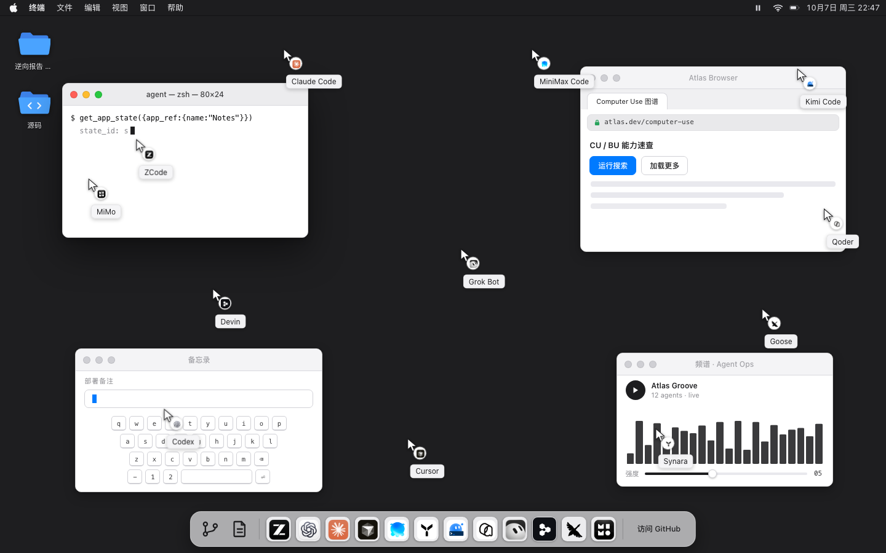](https://freeall12.github.io/computer-use/)

## 目录

- [为什么值得看](#为什么值得看)
- [核心发现 TL;DR](#核心发现-tldr)
- [能力矩阵总表](#能力矩阵总表)
- [二十个 Agent 分册](#二十个-agent-分册)
- [Quick Start](#quick-start)
- [深入阅读](#深入阅读)
- [仓库结构](#仓库结构)
- [Changelog](#changelog)
- [参与贡献](#参与贡献)
- [引用](#引用)
- [Star History](#star-history)
- [免责声明](#免责声明)
- [License](#license)

## 为什么值得看

没有哪家的官方文档会讲清它自己的桌面/浏览器控制是怎么实现的——本仓库把这 20 家拆到了符号与协议层。
分析基线：**2026-10 分批取证（各分册头部标注具体时点与版本），macOS arm64 为主**。按你的身份选路线：

| 你是 | 5 分钟路线 |
|---|---|
| **想给团队选型的开发者** | 先看下方[能力矩阵总表](#能力矩阵总表)（CU 载体 / 工具数 / BU 架构 / 安全模型 / 本机可用性一表定乾坤），再进 [comparison/capability-matrix.md](comparison/capability-matrix.md) 看逐层深度对照 |
| **想自己做 CU Agent 的工程师** | 直接翻 [reusable/patterns.md](reusable/patterns.md)（20 个可复用设计模式），再挑诉求最近的两家分册抄作业——后台不抢焦点看 Kimi、极简工具面看 Codex、纯视觉看 UI-TARS、半自动三原语看 Stagehand |
| **想研究竞品架构/谱系的人** | 看 [comparison/capability-matrix.md](comparison/capability-matrix.md) 的谱系关系图（谁内嵌 / 谁致谢 / 谁对齐 / 谁派生），再用 [docs/methodology.md](docs/methodology.md) 复现整套可复现的静态逆向流程 |

## 核心发现 TL;DR

1. **执行基线四型**：① 本地 Helper/驱动执行（9 家——Helper 持 TCC + 本地 IPC 鉴权 + 工具面隔离原生 API，其中 7 家独立 Helper 进程）；② **全云端执行、本地投影**（Devin：工具在云 VM，本地 CLI 只留 read/edit/grep/glob/exec；Fellou 的桌面控制同样归云端 Javis 委派）；③ **执行层外包**（Goose：单工具透传第三方 Peekaboo CLI，自身零 AX/CGEvent 代码；**Dia 是新形态——整个 agent 运行时外包给内嵌的 Claude Code SDK 2.1.280**）；④ **无原生能力**（Grok CLI 16 工具纯 coding；browser-use 与 Stagehand 的 CU=0 判定书——纯 BU 对照组）。
2. **白牌供应链出现了**：Grok Bot 桌面端由 **Anysphere（Cursor 母公司）整体代工换牌**——签名 TeamID `DCNK4UB866` 与 Cursor 完全一致、sidecar CDN 用 downloads.cursor.com、`sand-cua` 模型同名、JS 残留 `CUCursorService` 多路实证；**安全模型随代工继承**。
3. **公开底座与运行时复用无处不在**：trycua（MiniMax/Synara 内嵌 cua-driver，Kimi 公开致谢其签名键盘机制）；qwen-code（Qoder node_repl 内核经 `UPSTREAM.md` 确证）；Peekaboo（Goose 全部桌面执行层）；Codex sky（MiMo 自述 "inspired by"，明示清洁室复刻）；**Atlas 与 ChatGPT.app 同账号体系与安全话术、执行栈完全独立**（Operator 血统 `computer.*` vs Sky 血统）；Fellou 产品层 = 自家开源 Eko 框架（官方博客自认）。
4. **ZCode 的 CU SDK 逐字对齐 Codex `@oai/cua`**（SDK 头注释自述），但 `stateId/frameId/possibly_sent/controller lease/kill switch` 是事故驱动的自研加固——Codex 原始面对 stale 索引的对策只是「AX diff + 错误内嵌新鲜 diff + 流程纪律」。
5. **观察两条路线大分野**：主流是 **AX/语义树派**（16 家——OS AX 或浏览器内 a11y/DOM 语义快照，句柄台账 + 防漂移五级方案：流程纪律 → 双基线台账 → snapshot_id 绑定 → 描述校验 → verify_after 三态）；**纯视觉/截图派仅 4 家**：UI-TARS 与 Self-Operating Computer 截图直进模型、坐标即参数（每轮重截图自然刷新，无句柄可漂移），Comet 截图视觉循环部分混用，Fellou 归云端。SoM（截图编号标注）仍无人用经典视觉检测：Goose 的标注来自 AX 树（变体）、Fellou 用 SoM 标注截图、soc 仅作第三档定位、UI-TARS/browser-use 的 SoM 渲染只用于 UI 展示/遗留未用。
6. **后台定向输入（不抢焦点）四路线**：AX 写值、窗口相对事件路由、SLS 签名事件认证封包（Kimi：窗口全遮挡也能落键）、SkyLight/CGS 私有 API（Claude 跨 Space 拉窗；MiMo `SLEventPostToPid` 点击不抬窗；Grok `skylight-no-raise` 遮挡窗口坐标可命中）。
7. **半自动与全自动是两个物种**：Stagehand v4 拆掉内置 Agent 循环（官方迁移文档 "There is no `Agent`"）——控制流归开发者代码，AI 只在 act/observe/extract 三个逃生舱原语出现，77 个确定性 API 零 token，服务端缓存命中后**无 LLM 确定性重放**；其余 19 家全是「目标进去、循环自己转」的全自动形态。
8. **浏览器三载体**：① Agent 内嵌浏览器（IAB/WebView：ZCode/Codex/Cursor/MiniMax/Synara/Kimi/Qoder/MiMo 等）；② **浏览器即载体**（Comet/Dia/Atlas：Chromium fork 本身就是 agent 运行时，卖点都是「用你的登录态」）；③ 云端浏览器（Codex cdp / Cursor remote / Grok Bot 四件套 / Devin 云 VM）。极值两端：Goose 零内置、5 个第三方浏览器 MCP 外挂 vs browser-use 把浏览器 Agent 做成被集成的库（24 动作，「文本 DOM + `[index]`」句柄模式源头）。
9. **安全光谱从零到十层**：两端是 Self-Operating Computer **零安全层**（护栏仅 sleep(1) + 11 轮上限；lease/approval/kill-switch/allowlist 全仓 grep 0 命中）vs Synara 十层纵深（能力域门控、正则「可见使用」授权、2 秒安静期、防注入剥离、物理 Escape 专职进程、activation shield、审计、人接管……）。中间共识：审批分级/租约/防重放/验证回读四件套 + 三个变体（Grok「错误即指令」16 错误码→四档建议；Goose fail-open vs Claude/Cursor CU 专用授权成两极；Codex 锁屏守护暂停 vs MiMo 授权插件 + 1–20s 一次性租约）；MCP 注入 **fail-closed（未启用 = 工具不存在）**贯穿 20 家。
10. **本机可用性四档**：全链可用（ZCode/Codex/Synara/MiniMax/Kimi-CU/MiMo-CU）；载体在位门控未启用（Cursor-CU/Qoder-CU/Grok-CU）；断链或已卸载（Claude、Devin、Goose）；云端专属与静态基线（Devin/Grok-BU 无法静态验证；新 8 家中 Comet/Atlas 静态还原未运行、Dia 代码完整未启动且 CU 恒 ❌、其余 5 家上游源码基线）。

## 能力矩阵总表

精简版（20 行速览）；分维度深表与谱系图见 [comparison/capability-matrix.md](comparison/capability-matrix.md)。

| | CU 载体 | CU 工具数 | BU 架构 | 安全模型要点 | 本机可用 |
|---|---|---|---|---|---|
| **ZCode** | Node SEA Helper + ax_native.node（AX/CGEvent/SCK） | 14 | 内嵌 WebView（IAB） | 租约 + possibly_sent 防重放 + kill switch + fail-closed | ✅ |
| **Codex** | Swift Sky 服务（AX diff/Skyshot/CGEvent） | 3（面在 `cua` 全局） | iab + 扩展 + 云 + mcpapps 四后端 | 四层：OS→服务端审批→策略 prompt→熔断 + 锁屏守护 | ✅ |
| **Claude** | ComputerUseSwift + Rust app-cu-helper（SkyLight/CGS） | ~40 | 真浏览器扩展 + native messaging | 应用 tier（read/click/full）+ 独占锁 + Esc 急停 + teach mode | ❌ 链路断 |
| **Cursor** | Swift/Rust sidecar（CDN 签名分发）；云 worker xdotool | 16（+2 Win） | 内嵌 Electron webview + 合成 DOM 事件 | TCC + 输入租约 + Statsig 门控 + CDP 拒绝列表 | CU 关 / BU ✅ |
| **MiniMax** | trycua cua-driver 0.22.1（utility process） | 17 | 内嵌 WebContentsView + CDP（24 action） | 插件 Host Binding 门控 + lease + generation fencing + 遮罩/停止按钮 | ✅ |
| **Synara** | trycua cua-driver 0.28.2 patched（宿主托管） | 33 | 内嵌面板（BetterWright/CDP）+ CDP 家族 + cookie 导入 | `computer:control` 能力域 + 前台可见使用正则授权 + 物理 Escape | ✅ |
| **Kimi** | KimiCU.app（Swift，launchd 常驻；SkyLight 签名事件） | 18 + js | 扩展（WS daemon）+ 桌面内嵌（43 操作 MCP） | TCC 归服务 + UDS token + observation_context 隔离 + takeover | CU ✅ / BU 部分 |
| **Qoder** | 自研 Swift Runtime 1.0.12（AX/CGEvent/SCK + Bridge；非 trycua 系） | 11 SDK 方法（+Win 16 MCP + 录制 3） | 内嵌 + 扩展执行 + Browser Agent API 三链路（16 工具钉死 chrome-devtools-mcp 基线） | per-app 审批 + URL 禁区 + CUA 风格四档确认 + 扩展侧校验（无逐动作弹窗） | CU 关 / BU in-app ✅（42 次调用实证） |
| **Grok** | Swift Helper（**Anysphere 代工换牌**，TeamID 同 Cursor）；CLI 无原生能力 | 16（catalog 内嵌 sidecar，`--mcp-stdio` 直挂） | 本地零（负证据）；云端 browser_subagent + box + cookie 逐 origin 审批导入 | 「错误即指令」（16 码→四档建议）+ 租约/Esc/USER_ABORTED | CU 关 / BU 云端 |
| **Devin** | 云 VM `computer` 工具（本地 CLI 零 CU，三重负证据） | 1（云） | 云 VM Interactive Browser（CDP :29229）+ ACP `browser_preview` 投影 | 组织开关（admin）+ 同屏接管 + blueprint 登录态 | 全云端（本机已卸载） |
| **Goose** | 内置 extension → **纯透传 Peekaboo CLI**（brew 自动安装） | 1（`computer_control`） | 零内置；5 个第三方浏览器 MCP 扩展 | GooseMode×工具级×LLM 审查（fail-open）；无 CU 专用门 | 本机已卸载（源码基线 v1.53.0） |
| **MiMo** | 自研 Swift sky-mac（**Codex sky 明示清洁室复刻**）+ 签名伴生 app | 唯一 `js`（`@mimo/sky` 10 方法） | Browser Bridge MV3 扩展 + CDP 白名单（iab/extension/managed/raw cdp 四后端） | SAFETY_MODE 四档 elicitation + **独家锁屏操作**（授权插件 + 1–20s 一次性租约） | CU ✅ 已启用 / BU 未启用 |
| **browser-use** | 无（纯 BU 库，CU 判定书） | 0 | Python 库 24 动作：事件总线 + 15 watchdog，CDP 直连（自研 cdp-use，非 Playwright） | `<secret>` 占位符 + 域白名单 + 上传白名单 | ⚙️ 源码基线 v0.13.11（MIT） |
| **UI-TARS** | Electron 桌面端 + Agent TARS CLI（nut-js 全屏坐标派发） | 1 动作空间（17 动作，坐标即参数） | MCP 三模式（dom 18 / visual 9 / hybrid 20） | 无逐动作门 · call_user 人在回路 · AIO 沙箱 | ⚙️ 源码基线（commit 2ff41a9e） |
| **Stagehand** | 无（浏览器-only SDK，CU 判定书） | 0 | SDK 三原语 act/observe/extract + 77 确定性 API（MV3 扩展运行时） | 浏览器沙箱边界 · 占位符防泄漏 · 缓存/自愈全降级 | ❌ 未安装（npx 即起） |
| **Self-Operating Computer** | Python 框架 pyautogui（无 Helper、无 MCP） | 4（prompt 内嵌操作） | 0——浏览器 = CU 键盘路径 | **零**：仅 sleep(1) + 11 轮上限 | ⚙️ 需自备 key + TCC 运行 |
| **Comet** | Chromium fork 本体 + 3 内置 CRX（CDP Input 合成事件） | ComputerBatch 10 动作 | **浏览器即载体**：sidecar 网页云脑 + 本地执行 | 域名黑白名单 + 输入封锁 + Pause/Take control | ✅ 静态还原（未运行） |
| **Dia** | 无——内嵌 Claude Code SDK 2.1.280，**CU 预埋未接** | 0（SDK 自带 computer-use MCP 未接通） | `browser_use` REPL（Playwright 子集 over CDP）+ 80 工具 MCP | 双层 Seatbelt · 委派级授权门 · untrusted-data 免疫 | ⚙️ 代码完整未启动（CU 恒 ❌） |
| **Atlas** | Swift AuraAgents（内部代号 Dragonfruit）+ fork Chromium 150 页面执行 | 16 条 `computer.*`（Operator 协议，DOM 注入非 OS） | Chromium 全量（扩展/DevTools/AppleScript）+ browser memories | 登录态二态 + 站点黑名单 + 自动审批分级 + Safe Mode | ✅ 静态逆向（未安装） |
| **Fellou** | 开源侧 0 个 OS 工具；CU 归云端 Javis（宣称，中置信） | 开源 0 / 云端未验 | Eko 框架 13 工具 · SoM 标注观察 · 三运行时 | workflow_confirm（默认关）+ human_interact 四型 + request_help | ❌ 包未获得（Eko v4.1.3 基线） |

## 二十个 Agent 分册

每册统一四件套：README 总览 · computer-use.md · browser-use.md · evidence/inventory.md（路径:行号级证据）。

| Agent | 一句话口径 |
|---|---|
| [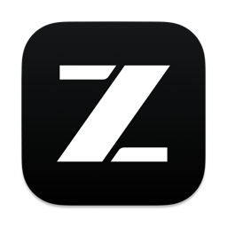&nbsp;**ZCode**](agents/zcode/README.md) | 本机能力最完整：五层架构 + 14 个 app 级工具；对 Codex 逐字对齐再自研加固（possibly_sent 防重放、controller lease、PiP/Ghost 可视化）*（插件 0.6.3 / Helper 3.14.4）* |
| [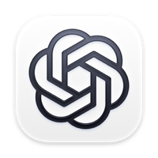&nbsp;**Codex**（OpenAI）](agents/codex/README.md) | 「一个 REPL、一个全局对象」极简面：MCP 只露 `js/js_reset`，`cua` 全局承载桌面+浏览器；Swift Sky 服务 + 四层安全 + 独有锁屏守护 *（CLI 0.155.1）* |
| [&nbsp;**Claude**（Anthropic）](agents/claude-code/README.md) | 工具面拆得最细（桌面 ~40 工具、三控制域）；SkyLight/CGS 私有 API 后台操作；本机链路断——「负证据判定」典型案例 *（CLI 2.1.212）* |
| [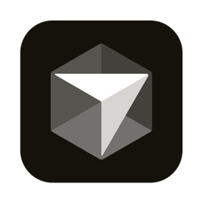&nbsp;**Cursor**](agents/cursor/README.md) | 一方 MCP provider；BU 本机可用（合成 DOM 事件 + ref 句柄 + CDP 拒绝列表）；CU 被 Statsig 门控，但随包 TS 源码静态还原出 16 工具 + Swift sidecar *（3.22.12）* |
| [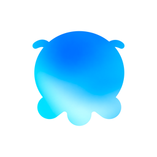&nbsp;**MiniMax Code**](agents/minimax-code/README.md) | Claude Code 工具协议兼容端（pi 内核）；CU 内嵌 trycua cua-driver（17 工具）；BU = CDP 24-action `browser` 工具，requiredNextTool 硬门 *（3.1.0）* |
| [&nbsp;**Synara**](agents/synara/README.md) | 多 Agent 编排产品；CU = patched cua-driver 0.28.2；安全模型最「社会工程」：正则判定「可见使用」意图 + 物理 Escape 急停；BU 三路径 *（0.9.2）* |
| [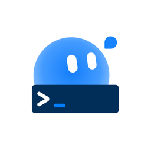&nbsp;**Kimi Code**（Moonshot）](agents/kimi-code/README.md) | 主打「后台操作不抢电脑」：KimiCU.app launchd 常驻持 TCC + SkyLight/SLS 签名事件 never-front；BU 双轨 = 扩展复用真实登录态 + 内嵌 43 操作 *（CLI 0.39.1 / KimiCU 0.6.6）* |
| [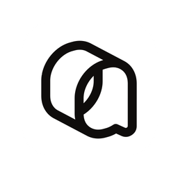&nbsp;**Qoder**（阿里系）](agents/qoder/README.md) | 自研 Electron workbench（非 VSCode fork），node_repl 迁自 qwen-code；CU 自研 Swift Runtime（四档确认 + 录制转 Skill）；BU in-app 16 工具钉死 chrome-devtools-mcp 基线，42 次调用实证 *（0.4.3 / Runtime 1.0.12）* |
| [&nbsp;**Grok**（xAI）](agents/grok/README.md) | 两个产品两个结论：CLI 零原生 CU/BU；Grok Bot 桌面端 = Anysphere 代工换牌（三路实证）+「错误即指令」16 错误码协议；BU 全云端 *（CLI 1.0.46 / Bot 0.66.0）* |
| [&nbsp;**Devin**（Cognition）](agents/devin/README.md) | 全云端执行、本地只做投影：`computer` 与 Interactive Browser 都在云 VM（CDP :29229）；本地 CLI 仅 read/edit/grep/glob/exec（三重负证据） *（CLI 3000.6.19）* |
| [&nbsp;**Goose**（Block，开源）](agents/goose/README.md) | 执行层完全外包的极值：单工具 `computer_control` 纯透传 Peekaboo CLI（brew 自动装），自身零 AX/CGEvent；BU 零内置纯 MCP 外挂；SoM 变体例 *（源码基线 v1.53.0）* |
| [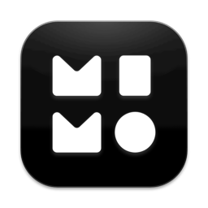&nbsp;**MiMo**（小米）](agents/mimo/README.md) | Codex sky 明示清洁室复刻；唯一 `js` REPL 工具 + 自研 Swift sky-mac（点击不抬窗 + 虚拟光标）；**独家锁屏操作**（SecurityAgentPlugins + 1–20s 一次性租约），本机已启用 *（运行时 0.7.11）* |
| [&nbsp;**browser-use**（开源）](agents/browser-use/README.md) | BU 事实标准库：「文本 DOM + `[index]` 句柄」模式源头——被集成而非被安装：24 动作、事件总线 + 15 watchdog、自研 cdp-use 直连 CDP；CU=0 判定书 *（v0.13.11 · MIT）* |
| [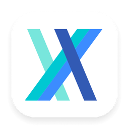&nbsp;**UI-TARS**（字节）](agents/ui-tars/README.md) | 纯视觉路线代表：截图直进 VLM、模型输出坐标经 nut-js 派发，AX 树在这条路线不存在；桌面端 + CLI 双产品一套内核 *（desktop 0.2.4 / CLI 0.3.0）* |
| [&nbsp;**Stagehand**（Browserbase）](agents/stagehand/README.md) | 半自动生产派：v4 拆掉内置循环（"There is no Agent"），控制流归开发者；act/observe/extract 三原语 + 77 确定性 API；AX 树文本观察不走截图 *（4.1.0 · MIT）* |
| [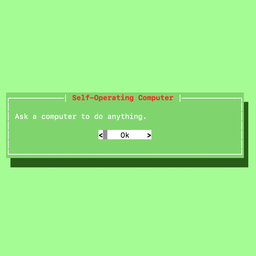&nbsp;**Self-Operating Computer**](agents/self-operating-computer/README.md) | CU 范式「化石级对照」：15 个 Python 文件、4 操作写进 prompt、pyautogui 全前台；安全零基线——2026 年各家恰是它的反面教材清单 *（v1.5.8 · MIT）* |
| [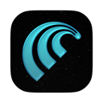&nbsp;**Comet**（Perplexity）](agents/comet/README.md) | 浏览器即 Agent 载体：大脑在 perplexity.ai 云，Chromium fork 发三张特权 CRX 通行证（23 个 `perplexity.*` 私有 API）；ComputerBatch 10 动作 CDP 合成 *（145.2.7632.4587）* |
| [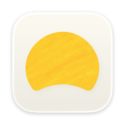&nbsp;**Dia**（The Browser Company）](agents/dia/README.md) | 「披着浏览器的 Claude Code 发行版」：整包内嵌 Claude Code SDK 2.1.280 + 45 个 agent 规格；CU 预埋未接（computer-use MCP 在 SDK 里），`browser_use` REPL 是唯一动作通道 *（1.51.1）* |
| [&nbsp;**Atlas**（OpenAI）](agents/atlas/README.md) | 浏览器即电脑：Operator 血统 `computer.*` 16 命令搬进本地 fork Chromium（内部代号 Dragonfruit），Playwright ARIA 快照 + JS 合成事件，与 ChatGPT.app 的 Sky 栈零复用 *（1.2026.189.1）* |
| [&nbsp;**Fellou**](agents/fellou/README.md) | 已停更的「第一个 Agentic Browser」：安装包全网死亡，分册以官方开源框架 Eko（MIT）+ Wayback 存档为基线；CU 归云端 Javis「full computer control」（宣称），本地零 OS 工具 *（Eko v4.1.3）* |

## Quick Start

三步用好本仓库（约 20 分钟）：

1. **（3 分钟）建立全景**：读上方 [TL;DR](#核心发现-tldr) 与[能力矩阵](#能力矩阵总表)，锁定你关心的 2–3 家；
2. **（15 分钟）精读 2 个分册**，推荐组合——自研加固 vs 它的对齐源头看 `agents/zcode/` + `agents/codex/`；两个架构极值看 `agents/grok/`（代工换牌）+ `agents/goose/`（执行层外包）；
3. **（1 分钟）跑参考实现自测**，确认每个分册描述的「观察 → 动作 → 验证」闭环在代码里真实成立（cleanroom 重构 + 零依赖 mock，无需安装被分析对象）：

```bash
node source/zcode/reference/test.mjs                    # 单家：ALL PASSED (18 checks)
for d in source/*/reference; do node "$d"/*.mjs; done   # 全量冒烟（grok 为协议 demo）
```

## 深入阅读

- **[comparison/capability-matrix.md](comparison/capability-matrix.md)** —— CU/BU 两张 20 行总矩阵 + 六派执行范式轴 + 观察机制 / 动作注入 / 安全模型深度对照（含零安全基线参照）+ 谱系关系图（10 种关系，含白牌代工与开源生态）+ 13 条勘误注记
- **[reusable/patterns.md](reusable/patterns.md)** —— **本仓库核心价值**：20 个可复用设计模式（P1 独立 Helper 进程 … P17 错误即指令协议 … P20 代工换牌识别），每条含问题定义 / 使用者（带分册链接）/ 实现要点 / 取舍，附最小可行架构组合图
- **[docs/methodology.md](docs/methodology.md)** —— 全程不运行、不抓包的静态还原流程：安装面侦察 → 签名/provenance 判定 → asar 解包 grep → 原生二进制四件套 → **负证据判定五面法** → 置信度标注体系 → 合规边界
- **[docs/STYLE.md](docs/STYLE.md)** —— 文档文风规范 v2：30 秒速览卡 + 架构一图 + 结论式标题；新 8 家分册与后续更新按此执行
- **[source/README.md](source/README.md)** —— 源码层整理规范：schemas / reference / vendor 三层；vendor 只收上游本身开源的组件（MIT cua-driver / qwen-node-repl / browser-use / stagehand / Eko 等），专有件仅出 schemas + cleanroom reference

## 仓库结构

```
computer-use/
├── README.md                        ← 本文
├── agents/                          ← 20 个 Agent 分册（80 份文档，10000+ 行）
│   └── <slug>/                      ← 统一四件套：README + computer-use + browser-use + evidence/inventory
├── comparison/capability-matrix.md  ← CU/BU 总矩阵 + 六派范式轴 + 谱系图
├── reusable/patterns.md             ← 20 个可复用设计模式（核心价值）
├── source/                          ← 源码层，17 个 agent 目录（schemas / reference / vendor 三层，规范见 source/README.md）
│   ├── zcode|codex|claude-code|cursor/   ← schema + cleanroom 重构参考实现（附自测脚本）
│   ├── minimax-code|synara/              ← MIT cua-driver 两版本 vendor（28 文件 blob-SHA 一致）
│   ├── browser-use|stagehand|            ← MIT 上游核心子集 vendor（21 文件 sha256 / PROVENANCE）
│   │   self-operating-computer/
│   ├── qoder/                            ← Apache-2.0 qwen-node-repl vendor（40 文件）
│   └── goose|ui-tars|mimo/ …             ← Apache-2.0 goose-mcp 子集 / UI-TARS 子集 / MIT 插件 SDK；专有件仅 schemas + reference
├── site/                            ← GitHub Pages 主站源码（在线版见顶部徽章）
└── docs/                            ← methodology.md（逆向方法论）+ STYLE.md（文风规范 v2）
```

## Changelog

- **2026-10-08** — 扩至 **20 家**（+ browser-use / UI-TARS / Stagehand / Self-Operating Computer / Comet / Dia / Atlas / Fellou），全库切换文风规范 v2（[docs/STYLE.md](docs/STYLE.md)）
- **2026-10-06** — 首批 7 家分册发布（ZCode / Codex / Claude / Cursor / MiniMax / Synara / Kimi）
- **2026-10-06** — 新增 Qoder；随后扩至 12 家（+ Grok / Devin / Goose / MiMo），同步上线 `source/` 源码层与 12 家横向对比
- **2026-10-06** — GitHub Pages 主站上线，12 家接入真实 logo

## 参与贡献

欢迎按同一口径补充新 Agent 分册，PR 请附证据：

1. **口径**：只读静态分析——不运行被分析对象、不抓包、不触碰凭据；结论标注分析时点版本与置信度；「没有某能力」的负证据判定须给出五面法（门控/安装/进程/配置/权限）依据。全流程见 [docs/methodology.md](docs/methodology.md)，文风见 [docs/STYLE.md](docs/STYLE.md)。
2. **目录结构**：`agents/<slug>/` 四件套（README 总览 + computer-use.md + browser-use.md + evidence/inventory.md，证据落到路径:行号）；整理出的接口事实按 [source/README.md](source/README.md) 三层规范入 `source/`。
3. **合规红线**：不含任何专有源码 / 二进制 / 凭据；非上游开源的代码不得 vendor；引用专有内容 ≤10 行/处且以说明为目的。

## 引用

研究或写作引用本仓库，请使用：

```bibtex
@misc{cubureverse2026,
  author       = {freeall12},
  title        = {CU/BU Reverse -- 主流 AI Agent 的 Computer Use 与 Browser Use 能力逆向},
  year         = {2026},
  howpublished = {\url{https://github.com/freeall12/computer-use}},
  note         = {20 个 Agent、80 份分册文档，分析基线 2026-10}
}
```

## Star History

[](https://star-history.com/#freeall12/computer-use&Date)

## 免责声明

- **独立研究**：与文中任何厂商（ZCode/智谱、OpenAI、Anthropic、Anysphere/Cursor、Perplexity、The Browser Company、字节/UI-TARS、Browserbase、OthersideAI、Fellou AI、MiniMax、Moonshot、阿里巴巴、xAI、Cognition、Block、小米，以及 trycua、steipete/Peekaboo、browser-use 等被引用开源项目）均无关联，未获授权或审阅；结论不代表官方立场，可能随版本更新失效（各分册头部标注分析时点版本）。产品名称与商标归各自所有者，提及仅为识别与学术比较。
- **合规边界**：仓库不含任何专有源码、二进制或凭据；仅对分析者本机合法安装的软件与上游开源仓库做静态分析——未运行被分析对象、未抓包、无任何 DRM 规避或访问控制绕过。
- **用途限制**：安全相关内容仅作架构学习与防御性工程参考；请勿将任何模式用于未经授权操控他人设备或绕过产品安全策略。

## License

[MIT](LICENSE) © 2026 freeall12。分册文档中引用的第三方文字版权归原权利人，引用仅为研究说明。
